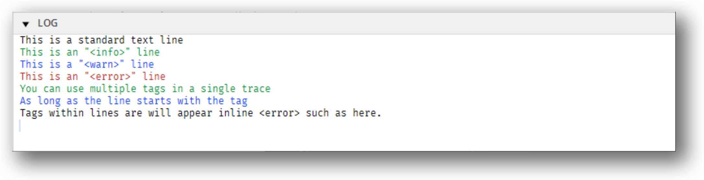

# xsbug

The `xsbug` JavaScript source level debugger is a full featured debugger that supports debugging modules and applications for [XS platforms](../xs/XS%20Platforms.md). The `xsbug` debugger is automatically launched when deploying debug builds and connects to devices via USB or over Wi-Fi. Similar to other debuggers, `xsbug` supports setting breakpoints, browsing source code, the call stack and variables. The `xsbug` debugger additionally provides real-time instrumentation to track memory usage and profile application and resource consumption.

A video demonstration of xsbug is available [here](https://youtu.be/vqu8gDV7AOo).

## Machine Tabs

Figure 1 shows the machine tab view. At the top of the window, there are tabs for all XS virtual machines connected to **xsbug** (highlighted in red in the image below). The orange bullet signifies a "broken" virtual machine. Select the tab to see where and why the virtual machine is broken.

> **Note:** A virtual machine is "broken" when stopped at a breakpoint, `debugger` statement or exception.

**Figure 1.** Machine tab view


The left pane displays:

* The **Kill** , **Break** , **Run** , **Step** , **Step In**   and **Step Out**   buttons. Corresponding menu items and shortcuts are also available in the **Debug** menu to control the virtual machine.
* The **Instrumentation** panel. Use this to track memory usage and profile application and resource consumption in real-time.
* The **Calls** stack panel. Select a row in this panel to see where the call happened.
* The **Locals**, **Modules**, and **Globals** panels. Use these to inspect values of local and global variables and see which modules are loaded. Dictionaries and arrays have the  icon next to their name. You can inspect the values of a dictionary's properties or an array's items by tapping the name to expand the row.

The right panes display:

* The selected file.
* The console. Each virtual machine has its own console.

## Breakpoints Tab

Figure 2 shows the Breakpoints tab view. Select the first tab (highlighted in red in the image below) to browse and search files and folders to set and clear breakpoints. Breakpoints can be edited even when no virtual machines are connected to **xsbug**.

To disable/enable a breakpoint, click on the breakpoint in the breakpoint tab then select the **Disable Breakpoint** or **Enable Breakpoint** option in the **Debug** menu.

To add files and folders to **xsbug**, select the **Open File...** and **Open Folder...** items in the **File** menu, or drag and drop files and folders into the **xsbug** window. 

To remove files and folders from **xsbug**, use the **Close**  button in the header of a files and folders panel.

**Figure 2.** Breakpoints tab view


The left pane displays:

* The **Breakpoints** themselves. Tap a row in this panel to see where the breakpoint is. In the header of this panel, there is a **Trash**  button to clear all breakpoints. 
* The **Search** panel. Use this to recursively search all the files in all the folders added to **xsbug**. 
* Zero or more files and folders panels. Tap folder rows to browse, select a file row to display the file.

The right pane displays:

* The selected file.
* The **xsbug** log, which merges the output of the consoles of all connected virtual machines. The log survives the disconnection of virtual machines.

## File Pane

Figure 3. shows the File pane (highlighted in red). Selecting a row in the **Breakpoints** or **Calls** panels, or selecting a file in a folder panel opens a right pane with source code. 

**Figure 3.** File pane


In the header of the pane:

* Tapping the parts of the path open folders in the Finder or Explorer.
* The **Edit**  button opens the file in its default editor.
* The **Find**  button extends the header with a field to search the file.
* The **Close**  button closes the file pane. 


## Preferences Pane

Figure 4. shows the Preferences pane. Selecting the **Preferences** item from the **xsbug** menu opens a right pane with preferences panels. 

**Figure 4.** Preferences pane


The **Break** preferences panel toggles the **Break On Start** and **Break On Exceptions** flags for all virtual machines.

The **Instruments** preferences panel allows you to select whether you want the instrumentation panel to automatically show while all virtual machines are running and hide when a virtual machine breaks.

The **Network** preferences panel displays the interfaces **xsbug** is listening on, and provides an edit field to change the port number **xsbug** is listening with. The default port number is **5002**. Changing the port number kills all connected virtual machines.

## Colorizing console/log with trace

You can colorize your output in the console/log pane when using `trace` on a per-line basis by using a tag at the start a line.  Available tags are:

* `<info>`
* `<warn>`
* `<error>`

The color used is dependent upon the dark/light theme that is selected.

For example,

```js
trace('This is a standard text line\n');
trace('<info>This is an "<info>" line\n');
trace('<warn>This is a "<warn>" line\n');
trace('<error>This is an "<error>" line\n');

trace('<info>You can use multiple tags in a single trace\n<warn>As long as the line ');
trace('starts with the tag\n');
```


