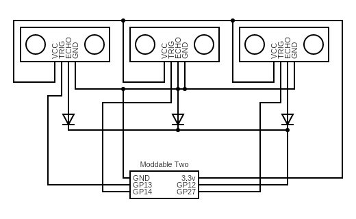

This example demonstrates how to trigger and read from multiple HC-SR04 sensors in a round-robin fashion. 

The Echo pins are all connected to a shared bus (ESP32 GPIO 12 by default) while each HC-SR04 needs a separate trigger pin (ESP32 GPIOs 13, 14, and 27 by default). To avoid damage to the HC-SR04 sensors, the Echo pins must be electrically isolated from each other. That can be accomplished with diodes, as shown in the diagram below:

