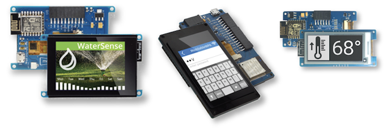
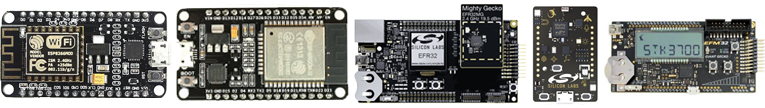

# Moddable SDK

Copyright 2017-2020 Moddable Tech, Inc. 
Revised: February 11, 2020

## Modern software development for microcontrollers

**The Moddable SDK is a combination of development tools and runtime software to create applications for microcontrollers.**

Microcontrollers are highly constrained devices compared to modern computers and mobile devices. A typical microcontroller used with the Moddable SDK has about 45 KB of free memory, 1 MB of Flash ROM, and runs at 80 MHz. The Moddable SDK uses many different techniques, both at build time and at run time, to work efficiently on these devices.

The primary programming language for development is JavaScript. The XS JavaScript engine at the center of the Moddable SDK implements the [2019 JavaScript language standard](http://www.ecma-international.org/publications/files/ECMA-ST/ECMA-262.pdf) with better than 99% conformance.[[1](#footnotes)] The constraints of the target microcontroller may limit the number of language features that can be used in combination by a single application.

The JavaScript language implemented in the Moddable SDK is the same language used in web pages and Node.js. The microcontroller that the scripts run on, however, is very different from a personal computer, server, or mobile device. These differences often require a different approach to using JavaScript. The APIs and objects in the Moddable SDK are quite different, being designed with the goal of minimizing memory use. Bring your existing experience with JavaScript, but be prepared to think about performance, code size, and memory use in a different way.[[2](#footnotes)]

As much as practical, the Moddable SDK is implemented in JavaScript. Portions of the Moddable SDK are implemented in C for performance or direct access to native APIs.[[3](#footnotes)] There is no C++.

A significant part of building efficient software for microcontrollers occurs at build time. The Moddable SDK contains many tools and options for the build process.[[4](#footnotes)] Take time to learn about these to get the best results.

> [1] *See also: [XS Conformance](./documentation/xs/XS%20Conformance.md)* 
[2] *See also: [XS Differences](./documentation/xs/XS%20Differences.md)* 
[3] *See also: [XS in C](./documentation/xs/XS%20in%20C.md)* 
[4] *See also: [Tools](./documentation/tools/tools.md), [manifest](documentation/tools/manifest.md)*

## Major features

### Networking

The Moddable SDK implements network sockets and a variety of standard, secure networking protocols built on sockets including HTTP/HTTPS, WebSockets, DNS, SNTP, and telnet.

There is also Bluetooth Low Energy (BLE) protocol support, enabling both BLE peripheral and central device development.

### Graphics

Two APIs for building modern user interfaces are available:

- **Commodetto**, a bitmap graphics library that provides a 2D graphics API. Commodetto includes the lightweight **Poco** rendering engine, a display list renderer able to efficiently render a single scanline at a time, saving considerable memory by eliminating the need for a frame buffer.
- **Piu**, a user interface framework built on top of Commodetto. Piu is an object-based framework that makes it easier to create complex, responsive layouts.

The Moddable SDK also includes command line tools for image format conversion, image compression, image rotation, font compression, and more. The build system automatically makes use of these tools.

### Hardware

The Moddable SDK implements a variety of hardware protocols including digital (GPIO), analog, PWM, and I2C. A number of drivers for common off-the-shelf sensors and [corresponding example apps](./examples/drivers) are also available.

### Source level debugger

The `xsbug` JavaScript source level debugger is a full-featured debugger that supports debugging modules and applications for XS platforms. 

Similar to other debuggers, `xsbug` supports setting breakpoints, browsing source code, and inspection of the call stack and variables. The `xsbug` debugger additionally provides real-time instrumentation to track memory usage and profile application and resource consumption.

> *See also: [xsbug documentation](./documentation/xs/xsbug.md)*

## Getting started

### Step 1: Set up your host environment

The [Getting Started](documentation/Moddable%20SDK%20-%20Getting%20Started.md) document provides step-by-step instructions for installing, configuring, and building the Moddable SDK for macOS, Linux, and Windows. It also includes instructions for building the example applications for Moddable hardware modules and the ESP8266 and ESP32 microcontrollers.

Build and configuration instructions for the Silicon Labs Gecko devices is at [Gecko Build](documentation/devices/gecko/GeckoBuild.md).

### Step 2: Try out some examples

The [examples](./examples) folder contains over 150 example apps that demonstrate how to use many features of the Moddable SDK. Many are less than one page of source code to focus on demonstrating how to use a specific capability. 

Keep in mind that not every example is compatible with every device target. The [readme.md](examples/readme.md) document provides a guide to building the examples and information to help you find the types of examples you are looking for.

See the **Supported Hardware** section below for information about which microcontrollers and dev boards the Moddable SDK supports. If you don't yet have any hardware, the Moddable SDK also includes simulators that run on macOS, Linux, and Windows. These are a great way to get started, and are invaluable as development accelerators. 

### Step 3: Build your own apps

When you are ready to customize the example apps or build your own from scratch, [documentation](./documentation) and source code for all of the JavaScript APIs is available. All documentation is provided in markdown format. Software modules that make up the runtime of the Moddable SDK are in the [modules](./modules) directory.

The **documentation**, **examples**, and **modules** directories share a common structure to make it straightforward to locate information.

- **base**: Fundamental runtime capabilities including time, timer, debug, instrumentation, and UUID
- **commodetto**: Bitmap graphics library
- **crypt**: Cryptographic primitives and TLS
- **data**: Base64 and hex encoding
- **drivers**: Device drivers for displays, touch inputs, sensors, and expanders
- **files**: Storage capabilities including files, flash, preferences, resources, and zip
- **network**: Network socket and protocols built on socket including HTTP, WebSockets, DNS, SNTP, telnet, and TLS; also, Wi-Fi and BLE APIs.
- **pins**: Hardware protocols including digital (GPIO), analog, PWM, and I2C
- **piu**: User interface framework

## Supported Hardware

**Moddable One**, **Moddable Two**, and **Moddable Three** are hardware modules that make it easy for developers to explore the Moddable SDK with inexpensive hardware. A Getting Started guide is available for each device:

- [Moddable One](./documentation/devices/moddable-one.md)
- [Moddable Two](./documentation/devices/moddable-two.md)
- [Moddable Three](./documentation/devices/moddable-three.md)

The Moddable SDK also includes support for the ESP8266 and ESP32 by Espressif, four models of Gecko by Silicon Labs, and the QCA4020 CDB by Qualcomm.

See the **Target platforms** section of the [readme.md](examples/readme.md) document in the examples folder for a full list of supported platforms.

## Displays

We have tested a variety of SPI displays with the ESP8266 and ESP32. Video demonstrations of these displays are [on our website](http://www.moddable.com/display). Wiring guides are available in the [documentation/displays](./documentation/displays) folder. The source code for the corresponding display and touch drivers is available in the [modules/drivers](./modules/drivers) folder.

## Source tree

The Moddable SDK repository contains the following top level directories.

- **build**: Files required for specific microcontroller targets, the simulator, and make files for build tools in the `tools` directory.
- **documentation**: All the documentation for the Moddable SDK. Documentation is provided in markdown format.
- **examples**: Example applications for many of the capabilities of the Moddable SDK. The [readme.md](examples/readme.md) document provides a guide to building the examples and information to help you find the types of examples you are looking for.
- **license**: The license agreements for the software provided in the Moddable SDK. The Contributor License Agreements are here as well.
- **modules**: The software modules that make up the runtime of the Moddable SDK. These include networking, graphics, user interface, hardware access, cryptographic primitives, and device drivers. All modules have a JavaScript API. Many modules are implemented in part using C.
- **tools**: Tools to build applications using the Moddable SDK. These include command line tools for image format conversion, image compression, image rotation, font compression, processing localization strings, compiling resources, and building applications from JSON manifest files. In addition, xsbug, the XS source level debugger, is here.
- **xs**: The XS JavaScript engine including its compiler and linker, and the test262 execution shell.

## Licensing

The Moddable SDK is provided under a combination of licenses that includes GPL 3.0, LGPL 3.0, Apache 2.0, and Creative Commons Attribution 4.0 Licenses. The [license](./licenses) directory contains additional information on the licenses used and licensing options. The [licensing article](http://www.moddable.com/license) on the Moddable web site describes additional background and a commercial licensing option.

## Security issues

We work to ensure that there are no security holes in the Moddable SDK. Still, it is nearly impossible to eliminate them all. Security researchers who identify potential security issues with our software are encouraged to open an [open an issue](./issues). We will respond to these as quickly as we can. If you prefer, you may also report security issues by [email](mailto:info@moddable.com).

## Questions? We're here to help

If you're an independent developer, we recommend you [open an issue](./issues). We'll respond as quickly as practical, and other developers can benefit from the answers to your questions.

To learn more about Moddable, see [our website](http://www.moddable.com).

For companies interested in the benefits of using JavaScript and the Moddable SDK to power your products, Moddable provides consulting services to help you get started. We're available to help with design, implementation, training, and support. 

You can also reach out to us on Twitter ([@moddabletech](https://twitter.com/moddabletech)). Following us on Twitter is the best way to keep up with what we’re doing—we post announcements about new blog posts there, along with other Moddable news.

You can contact us directly by e-mail at [info@moddable.com](mailto:info@moddable.com).
