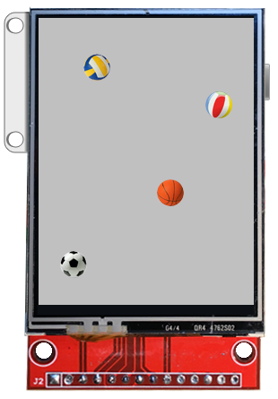
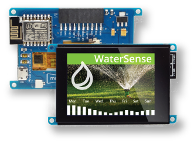

# Moddable SDK

Copyright 2017-2022 Moddable Tech, Inc. 
Revised: October 13, 2022

## Modern software development for microcontrollers

**The Moddable SDK is a combination of development tools and runtime software to create applications for microcontrollers.**

Microcontrollers are highly constrained devices compared to modern computers and mobile devices. A typical microcontroller used with the Moddable SDK has about 45 KB of free memory, 1 MB of Flash ROM, and runs at 80 MHz. The Moddable SDK uses many different techniques, both at build time and at run time, to work efficiently on these devices.

The primary programming language for development is JavaScript. The XS JavaScript engine at the center of the Moddable SDK implements the [2021 JavaScript language standard](http://www.ecma-international.org/ecma-262/11.0/index.html) with better than 99% conformance.[[1](#footnotes)] The constraints of the target microcontroller may limit the number of language features that can be used in combination by a single application.

The JavaScript language implemented in the Moddable SDK is the same language used in web pages and Node.js. The microcontroller that the scripts run on, however, is very different from a personal computer, server, or mobile device. These differences often require a different approach to using JavaScript. The APIs and objects in the Moddable SDK are quite different, being designed with the goal of minimizing memory use. Bring your existing experience with JavaScript, but be prepared to think about performance, code size, and memory use in a different way.[[2](#footnotes)]

As much as practical, the Moddable SDK is implemented in JavaScript. Portions of the Moddable SDK are implemented in C for performance or direct access to native APIs.[[3](#footnotes)] There is no C++.

A significant part of building efficient software for microcontrollers occurs at build time. The Moddable SDK contains many tools and options for the build process.[[4](#footnotes)] Take time to learn about these to get the best results.

> [1] *See also: [XS Conformance](./documentation/xs/XS%20Conformance.md)* 
[2] *See also: [XS Differences](./documentation/xs/XS%20Differences.md)* 
[3] *See also: [XS in C](./documentation/xs/XS%20in%20C.md)* 
[4] *See also: [Tools](./documentation/tools/tools.md), [manifest](documentation/tools/manifest.md)*

## Major features

### Networking

The Moddable SDK implements network sockets and a variety of standard, secure networking protocols built on sockets including HTTP/HTTPS, WebSockets, MQTT, mDNS, DNS, SNTP, and telnet.

There is also Bluetooth Low Energy (BLE) protocol support for both BLE peripheral and central device development.

### Graphics

Two APIs for building modern user interfaces are available:

- **Commodetto**, a bitmap graphics library that provides a 2D graphics API. Commodetto includes the lightweight **Poco** rendering engine, a display list renderer able to efficiently render a single scanline at a time, saving considerable memory by eliminating the need for a frame buffer.
- **Piu**, a user interface framework built on top of Commodetto. Piu is an object-based framework that makes it easier to create complex, responsive layouts.

The Moddable SDK also includes command line tools for image format conversion, image compression, image rotation, font compression, localization, and more. The build system automatically makes use of these tools.

### Hardware

The Moddable SDK implements a variety of hardware protocols including digital (GPIO), analog, PWM, and I2C. A number of drivers for common off-the-shelf sensors and [corresponding example apps](./examples/drivers) are also available.

### Source level debugger

The `xsbug` JavaScript source level debugger is a full-featured debugger that supports debugging modules and applications for XS platforms. 

Similar to other debuggers, `xsbug` supports setting breakpoints, browsing source code, and inspection of the call stack and variables. The `xsbug` debugger additionally provides real-time instrumentation to track memory usage and profile application and resource consumption.

> *See also: [xsbug documentation](./documentation/xs/xsbug.md)*

## Getting Started

1. To do anything with the Moddable SDK, you have to install it on your computer. This involves downloading this repository, installing some development tools, configuring settings over the command line, and building the Moddable SDK tools.

	The [Getting Started Guide](./documentation/Moddable%20SDK%20-%20Getting%20Started.md) in the `documentation` directory walks you through the whole process of installing the Moddable SDK.
	
2. With the Moddable SDK installed, you can build and run apps on hardware simulators.

3. To develop for a particular device, you need to install additional tools and SDKs for that device. The setup process for each device is different, but usually involves installing some additional SDKs, drivers, and development tools.

The SDKs and tools for a particular device are not created or maintained by Moddable, but we do provide detailed instructions to help you install them and get started developing for them with the Moddable SDK. The section below provides links to the setup instructions/developer guides for some of the devices we support.

### Hardware simulators

The Moddable SDK includes simulators that run on macOS, Linux, and Windows. These are a great way to get started, and are invaluable as development accelerators.

To use the simulator, you simply need to install the [Moddable SDK](./documentation/Moddable%20SDK%20-%20Getting%20Started.md).

A [video demonstration](https://www.youtube.com/watch?v=7GKOm3Tayjs) and information about the simulator is available in the **Simulator** section of the [tools documentation](./documentation/tools/tools.md).

### ESP8266 by Espressif

To use the Moddable SDK with ESP8266-based devices, you need to:

1. Install the [Moddable SDK](./documentation/Moddable%20SDK%20-%20Getting%20Started.md)
2. Install [ESP8266 tools](./documentation/devices/esp8266.md)

The Moddable SDK supports [many devices](./documentation/devices/esp8266.md#platforms) built on ESP8266, including the devices shown below.

| | | |
| :---: | :---: | :---: |
|  Moddable One[[5](#footnotes2)] |  Node MCU ESP8266[[6](#footnotes2)] |  Moddable Three[[7](#footnotes2)]

> [5] *See also: [Moddable One Developer Guide](./documentation/devices/moddable-one.md), Moddable [product page](https://www.moddable.com/product)* 
[6] *See also: [Using the Moddable SDK with ESP8266](./documentation/devices/esp8266.md)* 
[7] *See also: [Moddable Three Developer Guide](./documentation/devices/moddable-three.md)* 

### ESP32 by Espressif

To use the Moddable SDK with ESP32-based devices, you need to:

1. Install the [Moddable SDK](./documentation/Moddable%20SDK%20-%20Getting%20Started.md)
2. Install [ESP32 tools](./documentation/devices/esp32.md)

The Moddable SDK supports [many devices](./documentation/devices/esp32.md#platforms) built on ESP32, ESP32-S2, ESP32-S3, and ESP32-C3, including the devices shown below.

| | | |
| :---: | :---: | :---: |
|  Moddable Two[[8](#footnotes3)] |  Node MCU ESP32[[9](#footnotes3)] |  M5Stack
|  M5Stack Fire |  M5Stick C |   M5Atom Matrix

> [8] *See also: [Moddable Two Developer Guide](./documentation/devices/moddable-two.md), Moddable [product page](https://www.moddable.com/product)* 
[9] *See also: [Using the Moddable SDK with ESP32](./documentation/devices/esp32.md)* 

### Pico by Raspberry Pi

To use the Moddable SDK with Pico devices, you need to:

1. Install the [Moddable SDK](./documentation/Moddable%20SDK%20-%20Getting%20Started.md)
2. Install [Pico tools](./documentation/devices/pico.md)

The Moddable SDK supports [many devices](./documentation/devices/pico.md#platforms) built with the Raspberry Pi Pico, including the boards shown below:

| | | |
| :---: | :---: | :---: |
|  Raspberry Pi Pico W |  Pimoroni Pico Display |  ili9341
|  Adafruit QT Py |  Sparkfun Pro Micro |   LILYGO T-Display

### Gecko by Silicon Labs

To use the Moddable SDK with Gecko devices, you need to:

1. Install the [Moddable SDK](./documentation/Moddable%20SDK%20-%20Getting%20Started.md)
2. Install [Gecko tools](./documentation/devices/gecko/GeckoBuild.md)

The following developer resources are also available:

- [Silicon Labs Gecko support in Moddable SDK](https://blog.moddable.com/blog/gecko/) blog post
- [Bluetooth Low Energy Support Now Available in Moddable SDK](https://blog.moddable.com/blog/ble/) blog post

The Moddable SDK supports four Gecko boards, shown below.

| | | | |
| :---: | :---: | :---: | :---: |
|  Giant Gecko |  Mighty Gecko |  Thunderboard Sense 2 |  Blue Gecko 

### QCA4020 by Qualcomm

To use the Moddable SDK with the QCA4020, you need to:

1. Install the [Moddable SDK](./documentation/Moddable%20SDK%20-%20Getting%20Started.md)
2. Install [QCA4020 tools](./documentation/devices/qca4020/README.md)

The following developer resources are also available:

- [Qualcomm QCA4020 Now Supported by Moddable SDK](https://blog.moddable.com/blog/qca4020/) blog post by Moddable
- [QCA4020 Getting Started with the Moddable SDK](https://developer.qualcomm.com/project/qca4020-getting-started-moddable-sdk) blog post on the Qualcomm Developer Network
- [QCA4020 Modern UI Application Development with the Moddable SDK](https://developer.qualcomm.com/project/qca4020-modern-ui-application-development-moddable-sdk) blog post on the Qualcomm Developer Network

### WebAssembly (Wasm)

WebAssembly is supported in modern web browsers, both on computers and mobile devices. The Wasm support in the Moddable SDK is compatible with Safari, FireFox, and Chrome browsers.

To use the Moddable SDK with WebAssembly, you need to:

1. Install the [Moddable SDK](./documentation/Moddable%20SDK%20-%20Getting%20Started.md) for your host platform
2. Install [Wasm tools](./documentation/devices/wasm.md)

## Displays

We have tested a variety of SPI displays with the ESP8266 and ESP32. Video demonstrations of these displays are [on our website](http://www.moddable.com/display). Wiring guides are available in the [documentation/displays](./documentation/displays) directory. The source code for the corresponding display and touch drivers is available in the [modules/drivers](./modules/drivers) directory.

## Source tree

The Moddable SDK repository contains the following top level directories:

- [**build**](./build): Files required for specific microcontroller targets, the simulator, and make files for build tools in the `tools` directory.
- [**contributed**](./contributed): Unofficial projects and modules that show useful techniques for working with the Moddable API.
- [**documentation**](./documentation): All the documentation for the Moddable SDK. Documentation is provided in markdown format.
- [**examples**](./examples): Example applications for many of the capabilities of the Moddable SDK. The [readme.md](examples/readme.md) document provides a guide to building the examples and information to help you find the types of examples you are looking for.
- [**license**](./license): The license agreements for the software provided in the Moddable SDK. The Contributor License Agreements are here as well.
- [**modules**](./modules): The software modules that make up the runtime of the Moddable SDK. These include networking, graphics, user interface, hardware access, cryptographic primitives, and device drivers. All modules have a JavaScript API. Many modules are implemented in part using C.
- [**tools**](./tools): Tools to build applications using the Moddable SDK. These include command line tools for image format conversion, image compression, image rotation, font compression, processing localization strings, compiling resources, and building applications from JSON manifest files. In addition, xsbug, the XS source level debugger, is here.
- [**xs**](./xs): The XS JavaScript engine including its compiler and linker, and the test262 execution shell.

## API Documentation

The JavaScript APIs supported by the Moddable SDK are documented in a suite of documents in the [documentation](./documentation) directory. The documentation is an extensive reference, with numerous examples. The primary [Piu document](./documentation/piu/piu.md) alone is over 100 pages. All documentation is provided in markdown format.

See the [readme](./documentation#api-documentation-for-modules) document in that directory for an overview of the API documents. 

## Resources

In addition to the documentation and examples in this repository, we have several resources for developers.

| | |
| :---: | :---|
| | Our [Gitter chatroom](https://gitter.im/embedded-javascript/moddable) is a great place to ask questions and discuss the Moddable SDK with members of the Moddable team and other developers. |
|  | The [Moddable blog](https://blog.moddable.com) contains in-depth posts about new features and the Moddable, interesting projects by Moddable, and important updates to the Moddable SDK and XS JavaScript engine.
|  | [IoT Development for ESP32 and ESP8266 with JavaScript](https://www.moddable.com/book) is a book written by members of the Moddable team, [Peter Hoddie](https://www.moddable.com/peter-hoddie) and [Lizzie Prader](https://www.moddable.com/lizzie-prader).
|  | [実践Moddable JavaScriptではじめるIoTアプリケーション (技術の泉シリーズ](https://meganetaaan.hatenablog.com/entry/2020/09/13/011403) is a book written by developer Shinya Ishikawa.
|  | [Detailed release notes](https://github.com/Moddable-OpenSource/moddable/releases) for updates to the Moddable SDK are posted regularly on GitHub. |
|  | The Moddable SDK build tools have support TypeScript, so you can use build-time type checking in your embedded code. Details on the [blog](https://blog.moddable.com/blog/typescript/). |

## Licensing

The Moddable SDK is provided under a combination of licenses that includes GPL 3.0, LGPL 3.0, Apache 2.0, and Creative Commons Attribution 4.0 Licenses. The [license](./licenses) directory contains additional information on the licenses used and licensing options. The [licensing article](http://www.moddable.com/license) on the Moddable web site describes additional background and a commercial licensing option.

## Security issues

We work to ensure that there are no security holes in the Moddable SDK. Still, it is nearly impossible to eliminate them all. Security researchers who identify potential security issues with our software are encouraged to open an [open an issue](./issues). We will respond to these as quickly as we can. If you prefer, you may instead report security issues by [email](mailto:info@moddable.com).

## Questions? We're here to help

If you're an independent developer, we recommend you [start a discussion](./discussions) or join us in our [Gitter chatroom](https://gitter.im/embedded-javascript/moddable) if you have a question or want to talk about your projects. If you have trouble getting started or find any bugs, please [open an issue](./issues). We'll respond as quickly as practical, and other developers can benefit from the answers to your questions.

To learn more about Moddable, see [our website](http://www.moddable.com).

For companies interested in the benefits of using JavaScript and the Moddable SDK to power your products, Moddable provides consulting services to help you get started. We're available to help with design, implementation, training, and support. 

You can also reach out to us on Twitter ([@moddabletech](https://twitter.com/moddabletech)). Following us on Twitter is the best way to keep up with what we’re doing—we post announcements about new blog posts there, along with other Moddable news.

You can contact us directly by e-mail at [info@moddable.com](mailto:info@moddable.com).
